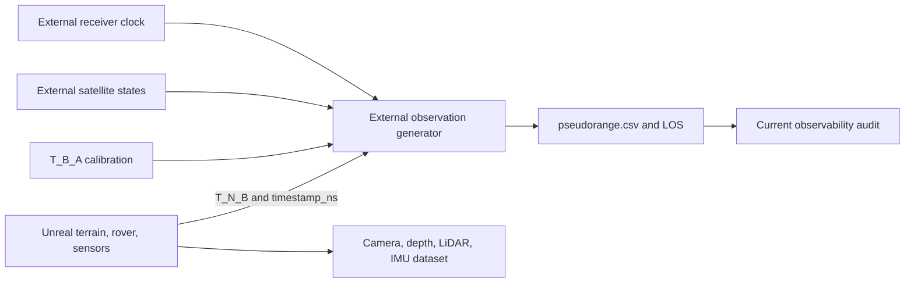

# Unreal 第一版仿真输出接口

版本：`unreal-mvp-interface-v1`；冻结日期：2026-09-08。

## 1. 目的与边界

本接口冻结一个约 `200 m × 200 m` 的短轨迹仿真输出，使 Unreal 生成的多传感器数据能与仓库现有的外部伪距/钟状态审计连接。它是**实现合同**，不是已经搭建完成的场景，也不是现实月面数据格式标准。

职责边界：

- **Unreal 内部**：地形、岩石、太阳光照、车辆运动、双目 RGB、深度、LiDAR、IMU 和真值轨迹。
- **Unreal 外部**：卫星轨道/星历、卫星视线、接收机钟差/钟漂、伪距或多普勒生成。
- **连接键**：整数纳秒仿真时间、真值 `T_N_B`、天线外参 `T_B_A` 和统一导航局部坐标系 `N`。

第一版不包括轮胎—月壤形变、全球月面、硬件在环、接收机射频传播、载波相位、完整定轨或紧耦合定位系统。

## 2. 坐标系合同

所有对外旋转使用右手系主动旋转；四元数顺序固定为 `w,x,y,z`。变换 `T_parent_child` 把 child 坐标中的点映射到 parent：`p_parent = R_parent_child p_child + t_parent_child`。

| ID | 含义 | 手性 | x | y | z | 长度/角度 |
| --- | --- | --- | --- | --- | --- | --- |
| `U` | Unreal 世界 | 左手 | 场景 North/前向 | East/右向 | Up | 内部 cm、degree |
| `N` | 导航局部 ENU | 右手 | East | North | Up | 对外 m、rad |
| `B` | 车体 FLU，原点为后轴中心上方定义点 | 右手 | Forward | Left | Up | m、rad |
| `C0`,`C1` | 左/右相机光学系 | 右手 | image right | image down | optical forward | m、rad |
| `L` | LiDAR | 右手 | Forward | Left | Up | m、rad |
| `I` | IMU | 右手 | Forward | Left | Up | m、rad |
| `A` | 外部导航天线相位中心 | 右手，轴与 `B` 平行 | Forward | Left | Up | m、rad |

固定世界转换：对 Unreal 位移 `p_U=[X_U,Y_U,Z_U] cm`，

```text
p_N_m = [Y_U, X_U, Z_U] / 100
```

这里的世界分量基变换记为

```text
C_NU = [[0,1,0], [1,0,0], [0,0,1]],  p_N_m = C_NU p_U_cm / 100
```

`det(C_NU)=-1`，所以它只是左手 `U` 分量到右手 `N` 分量的**基变换**，不是旋转，严禁直接转换成四元数。若 Unreal 导出的 actor 姿态矩阵 `R_UF` 把 actor 局部 Forward-Right-Up（`F`）分量映射到 `U`，而 `C_BF=diag(1,-1,1)` 把 `F` 分量改写为车体 FLU（`B`）分量，则对外姿态必须先按

```text
R_NB = C_NU R_UF C_FB,  C_FB = inverse(C_BF) = C_BF
```

做输出域和输入域的双侧基变换。`C_NU` 与 `C_FB` 都是行列式 `-1` 的基变换，因此合法输入应得到 `R_NB^T R_NB=I` 且 `det(R_NB)=+1`；**只有这个最终 proper rotation matrix 才能转换成 `w,x,y,z` 四元数**，并在转换后归一化及固定符号约定。LiDAR、IMU 和相机同理使用各自局部基变换；相机 optical 分量定义为 `[right,down,forward]=[Y,-Z,X]`。不得只交换欧拉角或凭符号人工判断。

后续导出实现必须包含四个姿态验证用例：单位姿态、Unreal actor 的 `+90° yaw`、`+90° pitch` 和 `+90° roll`。每个用例都要以 Unreal 的明确轴/正方向构造 `R_UF`，执行上述双侧变换，然后验证转换后的单位轴、`R^T R=I`、`det(R)=+1`，以及由最终矩阵生成四元数后重建的矩阵与原矩阵一致。

## 3. 时间与采样

- `timestamp_ns`：从仿真开始计的 `int64` 单调时间，不使用主机墙钟。
- `frame_index`：各传感器独立从 0 连续递增的 `uint64`。
- `truth` 与 IMU：100 Hz；双目 RGB、深度和 LiDAR：10 Hz。
- 同一触发时刻的双目、深度和 LiDAR使用相同 `timestamp_ns`，但保留各自 `frame_index`。
- LiDAR 每点必须输出相对扫描起点的 `time_offset_ns`；扫描参考时刻在元数据中固定为 `scan_start`。
- 丢帧不能重编号；在 `events.csv` 写入传感器、计划时间和原因。
- 第一版以固定物理步长运行。若渲染不能实时完成，允许慢于墙钟，但不得改变仿真时间间隔。

## 4. 真值输出

`truth/trajectory.csv`：

```csv
timestamp_ns,frame_index,p_N_B_x_m,p_N_B_y_m,p_N_B_z_m,q_N_B_w,q_N_B_x,q_N_B_y,q_N_B_z,v_N_B_x_mps,v_N_B_y_mps,v_N_B_z_mps,omega_B_x_radps,omega_B_y_radps,omega_B_z_radps
0,0,0.0,0.0,0.6,1.0,0.0,0.0,0.0,0.0,0.0,0.0,0.0,0.0,0.0
10000000,1,0.001,0.0,0.6,1.0,0.0,0.0,0.0,0.1,0.0,0.0,0.0,0.0,0.0
```

- `p_N_B`、`q_N_B` 表示 `T_N_B`。
- `v_N_B` 在 `N` 表达；`omega_B` 在 `B` 表达。
- 真值由 Unreal 刚体状态直接导出；不得把模拟 IMU 积分结果回填为真值。

## 5. 传感器最小输出

### 双目 RGB 与深度

- `camera/left/rgb/<timestamp_ns>.png`、`camera/right/rgb/<timestamp_ns>.png`：RGB8。
- `camera/left/depth/<timestamp_ns>.exr`：float32，单位 m，沿相机 optical z 的深度；无返回为 `NaN`。
- `camera/frames.csv`：`timestamp_ns,frame_index,left_rgb_path,right_rgb_path,left_depth_path`。
- 第一版名义参数：1024×1024、10 Hz、baseline 0.310 m；它是 LuSNAR 兼容候选 preset，不是硬件要求。

### LiDAR

每帧 `lidar/frames/<timestamp_ns>.csv`：

```csv
x_m,y_m,z_m,intensity,ring,time_offset_ns,return_id,semantic_id
4.20,-0.31,0.08,0.42,63,23100000,0,1
```

点坐标在 `L`；`intensity` 只定义为 `[0,1]` 仿真特征，不称为射频反射率或已标定材质反射率。`semantic_id` 可为 `-1` 表示未提供。第一版名义输出 10 Hz；量程、线数、垂直角表必须来自场景元数据，不能只编码在蓝图中。

### IMU

`imu/data.csv`：

```csv
timestamp_ns,frame_index,omega_I_x_radps,omega_I_y_radps,omega_I_z_radps,specific_force_I_x_mps2,specific_force_I_y_mps2,specific_force_I_z_mps2
0,0,0.0,0.0,0.0,0.0,0.0,9.80665
```

字段是 `I` 系角速度和比力，不是世界坐标加速度。重力向量及其是否按地球/月球设置必须写入 `metadata/simulation.json`；示例数值仅演示格式，不声明月球重力。

## 6. 标定、噪声和场景元数据

`metadata/calibration.json`：

```json
{
  "schema_version": "unreal-mvp-interface-v1",
  "quaternion_order": "wxyz",
  "transform_semantics": "p_parent=R_parent_child*p_child+t_parent_child",
  "camera_left": {"model": "pinhole", "width": 1024, "height": 1024, "fx_px": 610.17784, "fy_px": 610.17784, "cx_px": 511.5, "cy_px": 511.5, "distortion": [0, 0, 0, 0]},
  "extrinsics": {
    "T_B_C0": {"translation_m": [0.8, 0.16, 0.7], "quaternion_wxyz": [0.5, -0.5, 0.5, -0.5]},
    "T_B_C1": {"translation_m": [0.8, -0.15, 0.7], "quaternion_wxyz": [0.5, -0.5, 0.5, -0.5]},
    "T_B_L": {"translation_m": [0.5, 0.0, 0.8], "quaternion_wxyz": [1, 0, 0, 0]},
    "T_B_I": {"translation_m": [0.0, 0.0, 0.5], "quaternion_wxyz": [1, 0, 0, 0]},
    "T_B_A": {"translation_m": [0.0, 0.0, 1.0], "quaternion_wxyz": [1, 0, 0, 0]}
  }
}
```

示例外参只演示 schema；搭建场景时必须由实际组件布局覆盖，并进行基线和单位轴检查。

`metadata/simulation.json` 至少包含：

```json
{
  "schema_version": "unreal-mvp-interface-v1",
  "unreal_engine_version": "TBD",
  "project_git_commit": "TBD",
  "random_seed": 20260908,
  "fixed_step_s": 0.01,
  "gravity_N_mps2": [0.0, 0.0, -1.625],
  "clock": "simulation_monotonic",
  "sensor_noise": {
    "camera": {"model": "disabled-v1"},
    "lidar": {"model": "disabled-v1"},
    "imu": {"model": "disabled-v1"}
  }
}
```

噪声为关闭状态也必须显式记录，不能缺省解释为“真实”。后续噪声参数只有进入 `physical_parameter_evidence.csv` 且证据状态合格后才能成为主实验 preset。

`metadata/scene.json`：

```json
{
  "scene_id": "mvp_200m_v1",
  "extent_m": [200.0, 200.0],
  "terrain_z_source": "procedural_or_dem_identifier",
  "zones": [
    {"id": "flat", "type": "flat_regolith", "bounds_N_m": [0, 0, 60, 60]},
    {"id": "slope", "type": "low_texture_slope", "grade_deg": 8.0, "bounds_N_m": [60, 0, 140, 80]},
    {"id": "rim", "type": "crater_rim_rocks", "bounds_N_m": [120, 80, 200, 200]}
  ],
  "rock_density_per_m2": {"flat": 0.01, "slope": 0.005, "rim": 0.08},
  "sun_azimuth_N_deg": 135.0,
  "sun_elevation_deg": 10.0,
  "route_N_m": [[10, 10], [70, 30], [130, 65], [175, 130]]
}
```

上述场景数值是第一版验收配置，不是现实月面统计结论。太阳角定义为从 North 朝 East 增大的方位角及地平线上方高度角。

## 7. 数据目录

```text
run_<UTC_creation_time>_<seed>/
  metadata/
    calibration.json
    simulation.json
    scene.json
  truth/trajectory.csv
  camera/frames.csv
  camera/left/rgb/<timestamp_ns>.png
  camera/right/rgb/<timestamp_ns>.png
  camera/left/depth/<timestamp_ns>.exr
  lidar/index.csv
  lidar/frames/<timestamp_ns>.csv
  imu/data.csv
  events.csv
```

大型仿真输出属于外部数据，不提交到 Git；仓库只保存 schema、小型文本示例、生成配置和校验摘要。

`lidar/index.csv` 字段固定为：

```csv
timestamp_ns,frame_index,points_path,scan_start_ns,scan_end_ns
0,0,lidar/frames/0.csv,0,100000000
```

其中 `points_path` 必须是数据集根目录内的相对路径；每点 `time_offset_ns` 必须落在 `[0, scan_end_ns-scan_start_ns]`。`events.csv` 字段固定为：

```csv
timestamp_ns,sensor,event_type,expected_frame_index,reason
1200000000,lidar,dropped_frame,12,render_deadline_missed
```

正常无事件时仍保留表头。缺帧必须由计划时间、传感器、预期帧号和原因解释，不能通过重编号隐藏。

## 8. 与外部伪距/钟代码的连接

1. 读取 `truth/trajectory.csv` 的 `T_N_B(t)` 和 `metadata/calibration.json` 的 `T_B_A`，计算天线真值 `p_N_A(t)`。
2. 外部轨道工具把卫星位置转换到同一 `N` 系，并生成 `satellite_state.csv`：

```csv
timestamp_ns,satellite_id,p_N_sat_x_m,p_N_sat_y_m,p_N_sat_z_m,satellite_clock_range_bias_m,visible_geometry_only
1000000000,SAT01,1200000.0,800000.0,1600000.0,0.0,true
```

3. 外部接收机钟生成器输出 `receiver_clock.csv`：

```csv
timestamp_ns,receiver_clock_range_bias_m,receiver_clock_range_drift_mps,model_id,random_seed
1000000000,12.4,0.03,bias_drift_v1,42
```

4. 外部观测生成器计算几何距离、卫星钟、接收机钟和明确列出的误差项，输出：

```csv
timestamp_ns,satellite_id,pseudorange_m,sigma_pseudorange_m,los_N_x,los_N_y,los_N_z,geometry_visible,measurement_available
1000000000,SAT01,2150043.2,10.0,0.557,0.371,0.743,true,true
```

5. 当前 `observability_audit.py` 只消费按历元组织的 `los_N_*`、测距标准差和钟模型参数；它不消费 Unreal 图像/点云，也不把真值直接作为在线位置因子。

必须区分 `geometry_visible` 与 `measurement_available`：前者只表示几何/地形通视，后者还可包含链路预算、接收机门限和服务状态。第一版允许链路模型为空，但不得把两列合并。



## 9. 第一版验收标准

1. 一个约 200 m × 200 m 场景同时包含平坦区、低纹理坡地、坑缘或碎石区。
2. 一条短轨迹依次经过至少两个区域；持续时间和实际路径长度写入摘要。
3. 所有时间戳单调；名义频率和缺帧可由索引文件复算。
4. `T_N_B`、全部 `T_B_sensor` 和 UE→ENU 转换通过单位姿态、`+90° yaw`、`+90° pitch`、`+90° roll` 测试；各输出旋转矩阵正交且行列式为 `+1`。
5. 双目同时间戳，baseline 与元数据一致；深度单位为米。
6. LiDAR 含 ring 和逐点 `time_offset_ns`；IMU 明确输出比力。
7. 外部代码能从同一时间戳生成至少一段 `satellite_state.csv`、`receiver_clock.csv` 和 `pseudorange.csv`，但第一版不要求运行完整定位后端。
8. 保存配置、随机种子、软件版本、文本 schema 和校验摘要；不提交大型数据或 Unreal 缓存。

达到以上标准只表示接口和最小数据流跑通，不表示场景具有真实月壤物理性质，也不表示卫星辅助定位有效。

## 10. 可执行校验范围

- **合成接口样例**（`--scope synthetic`）：要求真值、IMU、LiDAR 文本及外部卫星/钟/伪距表；相机 RGB、深度和 Unreal 引擎行为明确报告为未覆盖。
- **完整 Unreal 导出**（`--scope complete`）：额外要求相机索引及其引用的真实 RGB/深度文件存在。文件存在不等于已经验证编码、像素内容或深度物理正确性。

UE 原生 actor 输出必须先按第 2 节转换；已经由传感器插件输出为 ENU/FLU/optical 的数据不得重复转换，插件和版本必须写入元数据。位置基变换不能直接套用于轴向矢量：角速度是伪矢量，其跨手性表达必须由引擎适配器按照已核实约定处理。本仓库仅验证输入旋转矩阵；UE yaw/pitch/roll 的引擎正方向和插件坐标仍待实机测试。

运行确定性文本样例：

```bash
python tools/generate_unreal_fixture.py --output .local/unreal_mvp_synthetic
python tools/validate_unreal_dataset.py .local/unreal_mvp_synthetic --scope synthetic --report .local/unreal_mvp_synthetic/validation_report.json
python tools/validate_unreal_dataset.py .local/unreal_mvp_synthetic --scope complete
```

第三条命令应失败，因为样例故意不伪造 RGB/EXR。校验器检查 schema、数值和跨表关系，但不能仅凭文本确认 Unreal 欧拉角方向、插件是否重复换轴、图像内容、LiDAR 光线物理或时间戳在引擎中的实际行为。

生成器仅接受新目录或空目录，不删除已有内容；重复运行请使用新的输出目录。完整校验要求引用文件为非空普通文件，仍不验证图像解码或像素内容。
